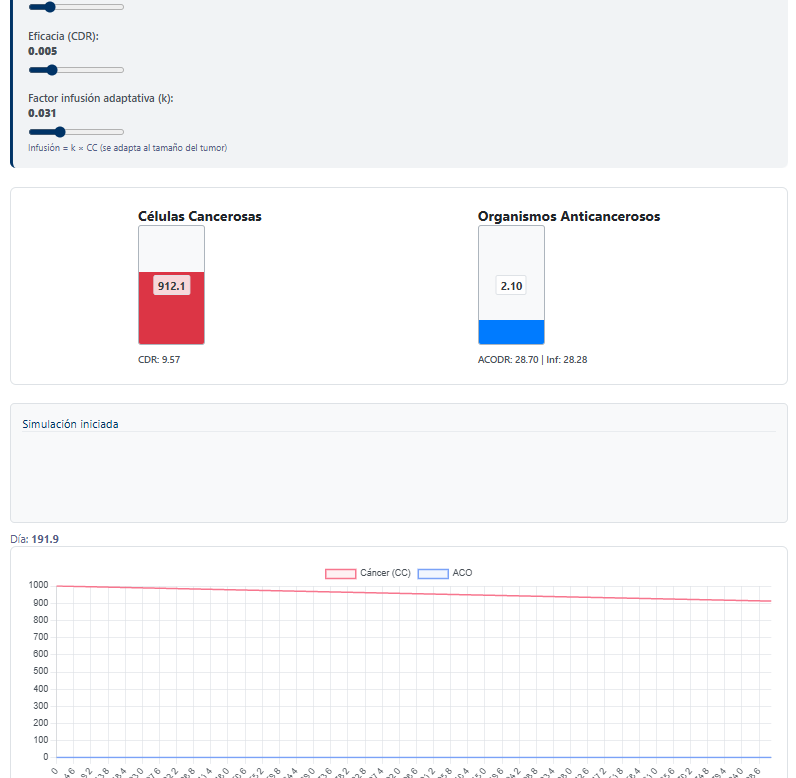
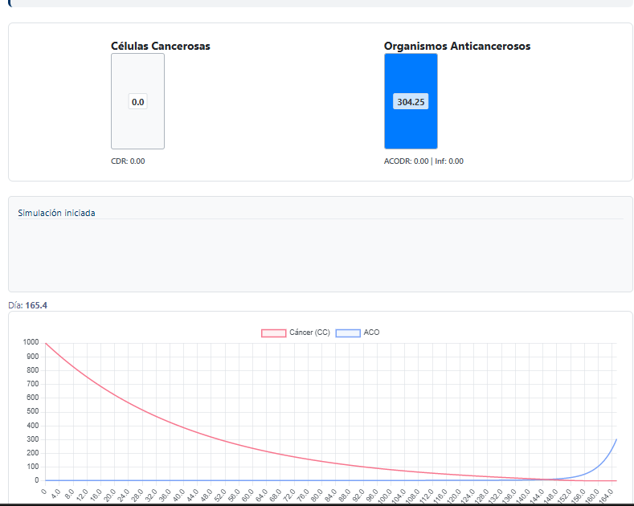

markdown
# 🧬 Simulación Dinámica: Tratamiento del Cáncer

Simulador interactivo basado en el modelo de Donald R. Drew (*Introducción a la Dinámica de Sistemas Aplicada*).  
Se modela la lucha entre células cancerosas (CC) y organismos anticancerosos (ACO) mediante ecuaciones diferenciales no lineales, resueltas con el **método de Euler**.

👉 **Probar en vivo:** [Simulador en Netlify](https://genuine-stroopwafel-b2567b.netlify.app/)  
📂 **Repositorio:** [github.com/YEFFERSON1234/ModeloCancer](https://github.com/YEFFERSON1234/ModeloCancer)

---

## 📊 Capturas de la simulación

### Diagrama de flujo del modelo 


### Comportamiento dinámico 


---

## 🔬 Cómo funciona

### Variables de estado
| Variable | Descripción |
|----------|-------------|
| **CC**   | Células cancerosas (masa tumoral) |
| **ACO**  | Organismos anticancerosos (tratamiento) |

### Ecuaciones principales
ΔCC/Δt = (CC × 0.01) - (CC × ACO × CDR_CF)
ΔACO/Δt = (ACO × 0.2) - (ACO × CC × 0.025) + k·CC

text
- `CDR_CF`: eficacia del tratamiento (por defecto 0.005)
- `k`: factor de infusión adaptativa (por defecto 0.02; `k=0` recupera el modelo original de Drew)

La infusión proporcional al tumor (`k·CC`) evita que el ACO desaparezca y permite la remisión con dosis moderadas.

---

## 🧪 Parámetros modificables
La interfaz ofrece tres deslizadores:
1. **Dosis inicial de ACO** (0.1 – 10)
2. **Eficacia del tratamiento** (CDR_CF: 0.001 – 0.02)
3. **Factor de infusión adaptativa** (k: 0 – 0.1)

---

## 🛠️ Ejecutar localmente
1. Cloná el repositorio:
   ```bash
   git clone https://github.com/YEFFERSON1234/ModeloCancer.git
Abrí index.html en cualquier navegador. No requiere servidor.

🎓 Autor
Yefferson Miranda José
Escuela Profesional de Ingeniería de Sistemas
Universidad Nacional del Altiplano (UNAP)
Curso: Investigación de Operaciones